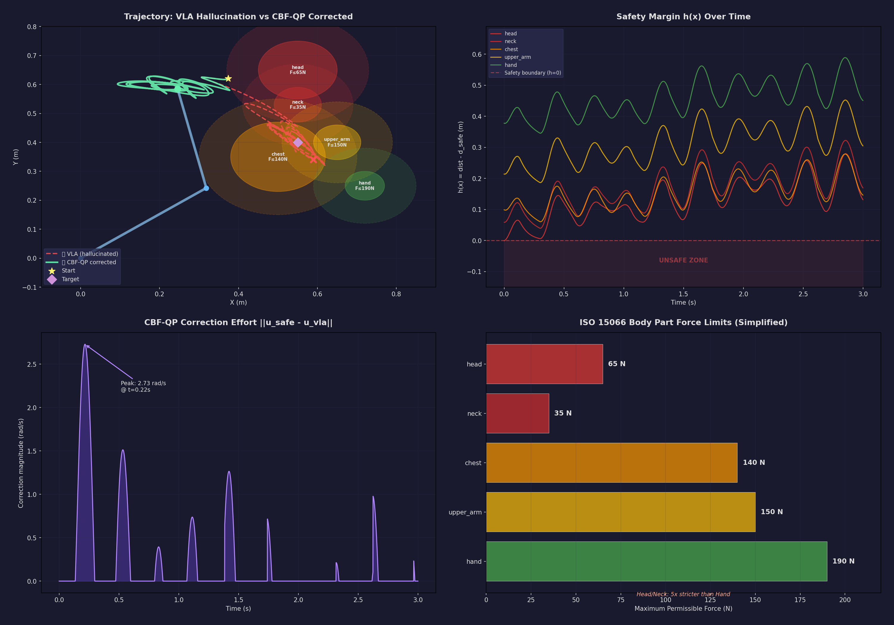

# SafeGuard CBF-QP: VLA Safety Filter Demo

[](https://opensource.org/licenses/MIT)
[](https://www.python.org/downloads/)

> **Real-time safety filtering for Vision-Language-Action (VLA) models using Control Barrier Functions.**

When a VLA model hallucinates, the robot arm doesn't know. This demo shows how a CBF-QP safety layer can intercept and minimally correct unsafe trajectories **before** they reach the hardware — at 1kHz, in real-time.



---

## What This Demo Does

1. **Simulates VLA trajectories** — including normal trajectories and "hallucinated" ones (OOD drift, cross-modal misalignment)
2. **Applies CBF-QP safety filtering** — solves a Quadratic Program at each timestep to find the minimum correction that keeps the system safe
3. **Visualizes the result** — shows original (unsafe) vs. corrected (safe) trajectories with ISO 15066 human body risk zones

## Core Math

### Control Barrier Function (CBF)

For a safety constraint $h(\mathbf{x}) \geq 0$ (e.g., "stay away from the human head"), the CBF condition requires:

$$\dot{h}(\mathbf{x}, \mathbf{u}) + \alpha \cdot h(\mathbf{x}) \geq 0$$

where $\alpha > 0$ controls how aggressively the system enforces safety.

### QP Safety Filter

Given the VLA's desired control $\mathbf{u}_{VLA}$, find the closest safe control:

$$\min_{\mathbf{u}} \quad \frac{1}{2} \|\mathbf{u} - \mathbf{u}_{VLA}\|^2$$

$$\text{s.t.} \quad \dot{h}_i(\mathbf{x}, \mathbf{u}) + \alpha_i \cdot h_i(\mathbf{x}) \geq 0, \quad \forall i$$

This is a convex QP — solvable in <1ms on embedded hardware.

## Quick Start

```bash
# Clone
git clone https://github.com/YOUR_USERNAME/safeguard-cbf-demo.git
cd safeguard-cbf-demo

# Install dependencies
pip install -r requirements.txt

# Run the demo
python safeguard_cbf_demo.py

# Or run the interactive notebook
jupyter notebook safeguard_demo.ipynb
```

## Requirements

```
numpy>=1.21
scipy>=1.7
matplotlib>=3.5
cvxpy>=1.3        # For QP solving
```

## What You'll See

The demo generates 4 figures:

| Figure | Description |
|--------|-------------|
| **Trajectory Comparison** | VLA hallucinated trajectory vs. CBF-corrected trajectory |
| **Safety Margin** | $h(\mathbf{x})$ over time — stays positive after filtering |
| **Control Effort** | How much correction was needed at each timestep |
| **ISO 15066 Risk Map** | Human body part zones with different force limits |

## Architecture

```
VLA Model Output (u_vla)
        │
        ▼
┌─────────────────┐
│  CBF-QP Filter   │  ← Solves QP at each timestep
│  (this demo)     │  ← Multiple safety constraints
│                  │  ← ISO 15066 body part mapping
└────────┬────────┘
         │
         ▼
  Safe Control (u_safe)
         │
         ▼
  Robot Hardware
```

## Related Patents

This demo is a simplified illustration of the engineering principles behind:

- **G2**: CBF-based VLA hallucination interception with ISO 15066 mapping
- **L3**: Cross-modal consistency verification for hallucination detection
- **M1**: Conformal prediction-based dynamic threshold calibration

Part of a 71-patent portfolio for embodied AI safety. [Contact us](mailto:https://github.com/aoright/safeguard-cbf-demo.git) for the full SafeGuard SDK.

## License

MIT — use freely for research and development.

## Contributing

Issues and PRs welcome! Areas where we'd love help:

- Adapting to ROS2/MoveIt2
- Franka Emika / UR5e real-hardware integration
- Additional safety constraint types
